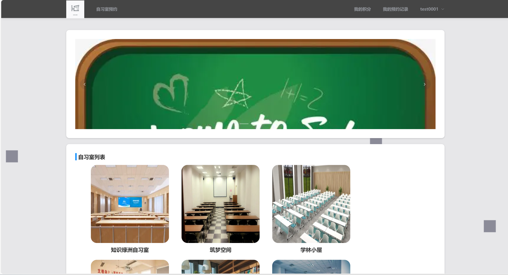
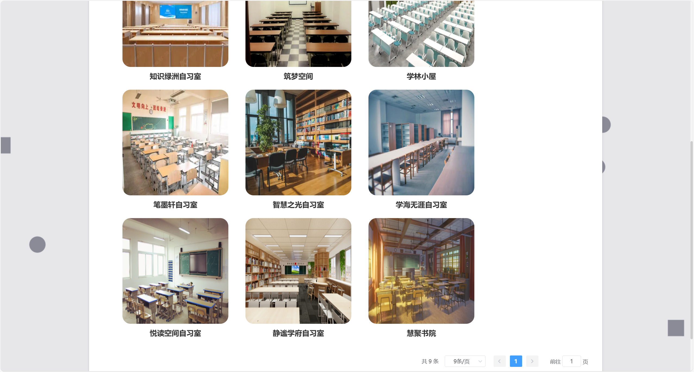
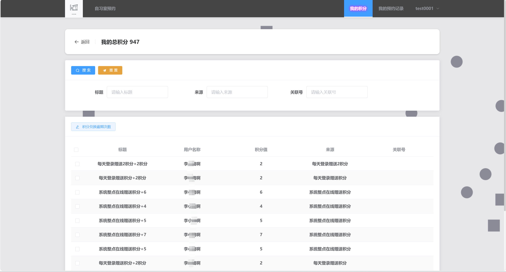
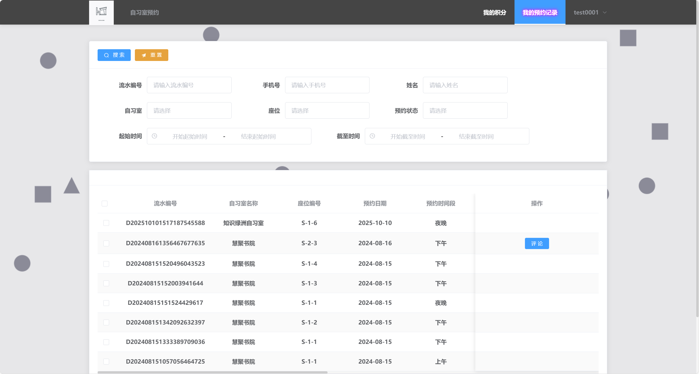
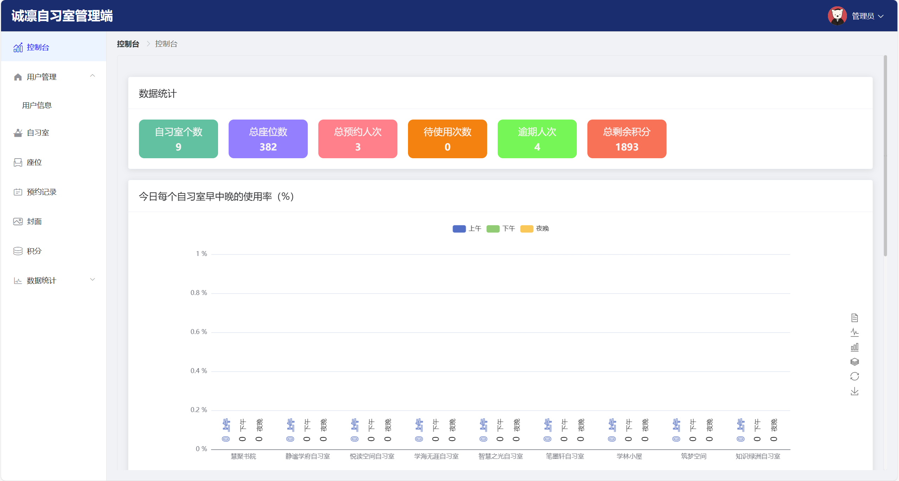
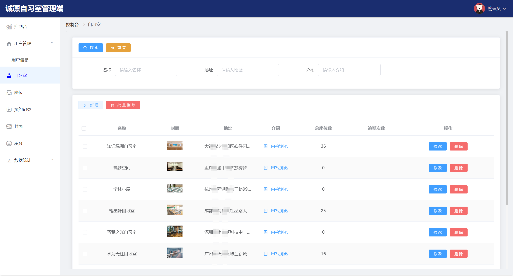
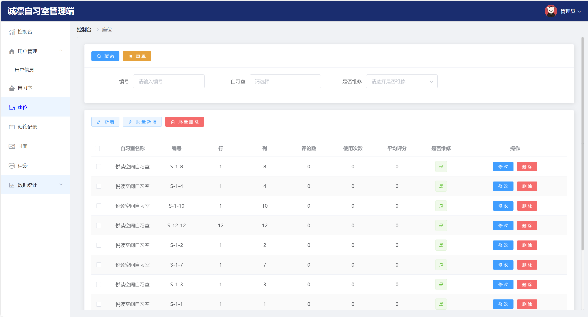
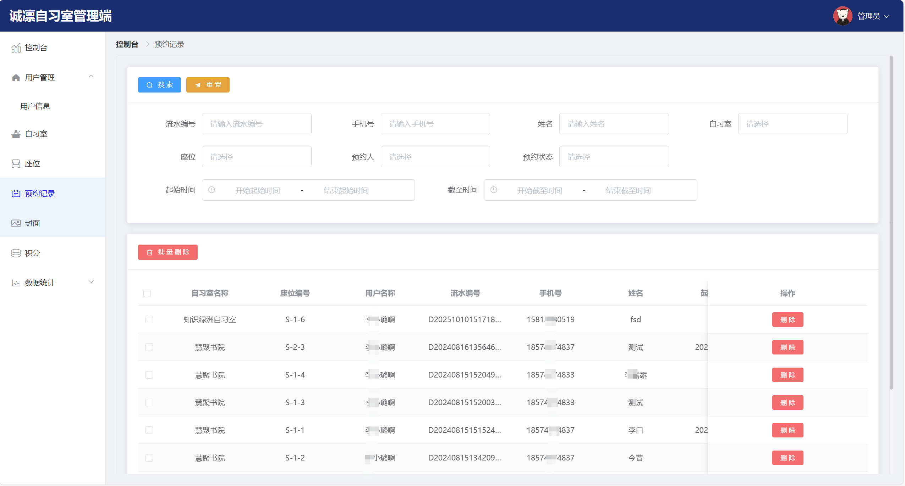

# springbootA540
springbootA540自习室座位预约系统
 
## 源码问题查看主页咨询

### 一、关键词
自习室座位预定系统，自习室座位在线预约系统，自习室座位管理预约系统

### 二、作品包含
源码+数据库+全套环境和工具资源+本地部署教程

### 三、项目技术
前端技术：Html、Css、Js、Vue2.0、Element
后端技术：Java、SpringBoot3.0、MyBatis

### 四、运行环境（以下版本亲测，其他版本未知，请自测）
开发工具：IDEA/eclipse  + VSCODE

数据库：MySQL5.7（最低要5.7版本）

数据库管理工具：Navicat10以上版本

环境配置软件： JDK17 + Maven3.6.3

前端Nodejs：16

浏览器：谷歌浏览器

### 五、项目介绍
项目编号：springbootA540

自习室座位预约系统是通过线上预约方式，帮助用户提前锁定座位、避免现场争抢，同时助力管理者高效管理座位资源的工具。
系统包括两种角色：管理员和用户

管理员权限：后台首页数据可视化，个人信息管理，用户管理，自习室管理，座位管理，预约记录管理，封面管理，积分管理，数据统计（数据可视化）

用户权限：登录注册，自习室预约，领取积分，预约记录管理，个人信息管理 

### 六、运行截图

 
